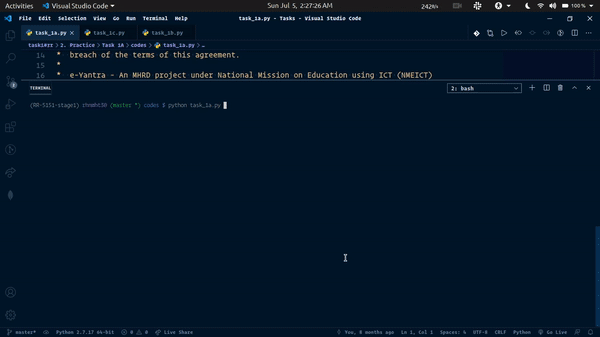
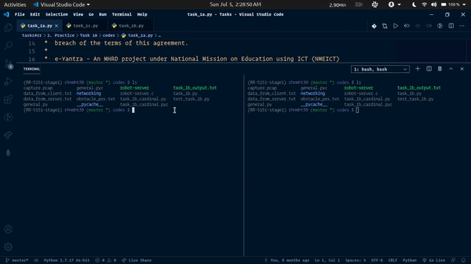
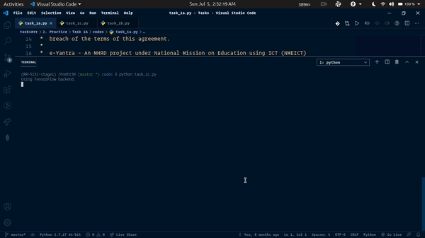

# e-yantra

## Task 1A: Calculate shortest path using BFS and plot that in given maze image.

## Task 1B: Calculate shortest path using BFS, built socket server in C to throw dyanmic obstacles, re-calculate shortest path.

## Task 1C: Calculate shortest path using BFS, extract images of numbers along the shortest path.

